# Tal'a (طلعة) Frontend

## Overview

**Tal'a - طلعة** is a web app that helps people in Bahrain discover new places to go out to, instead of going to the same familiar spots. This is the frontend client: it lets users browse and filter places, get personalized recommendations based on their visit history and a cooldown system, find places near their current location, log visits, save favorites, leave reviews, and build shareable outing plans they can invite friends to join.

## Live Application

- **Frontend:** [Deployed frontend](https://talafrontend.netlify.app/)
- **Backend API:** [Deployed Backend](https://tala-backend-83km.onrender.com/)
- **Backend Repository:** [Backend Github Repository](https://github.com/WA-2211/Tala-Backend)

## Screenshots

### Home Page
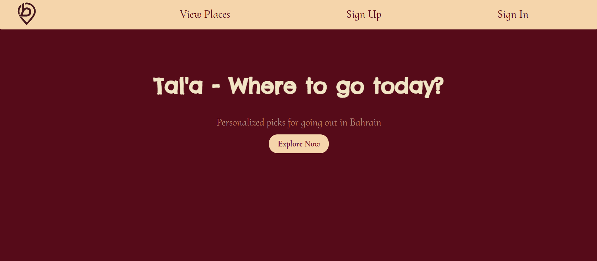

### Guest Pages 
 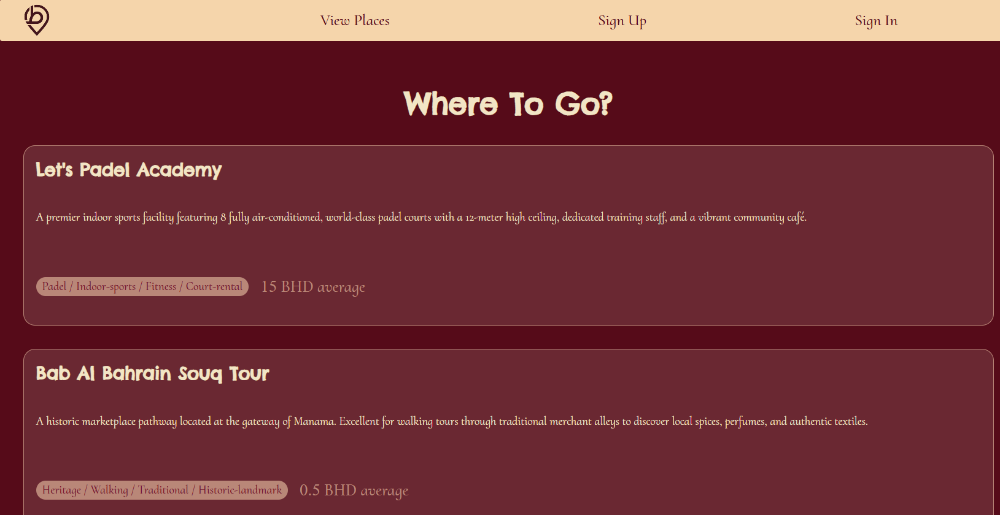

 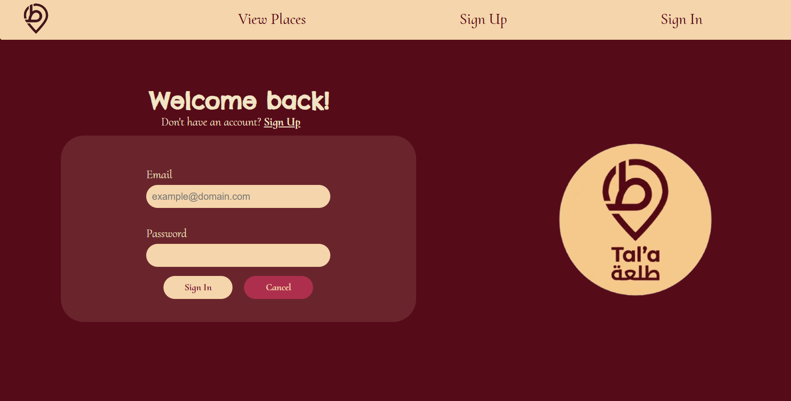

 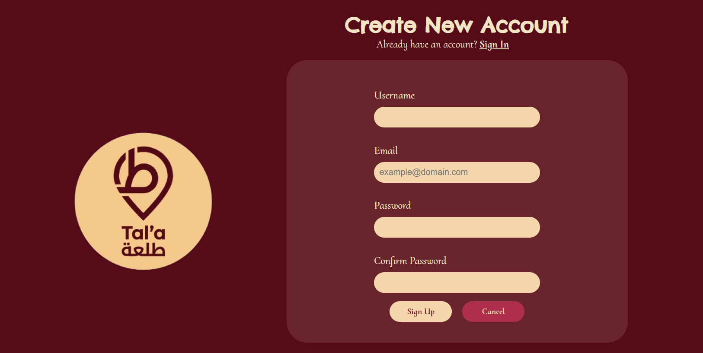

 ### Sigend-In User Pages
 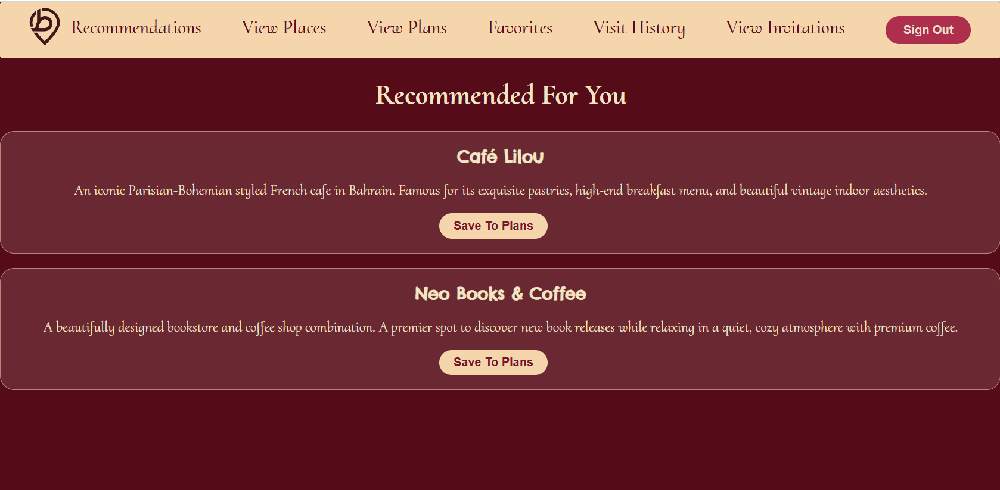

 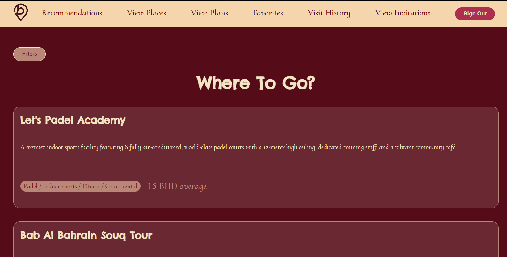

 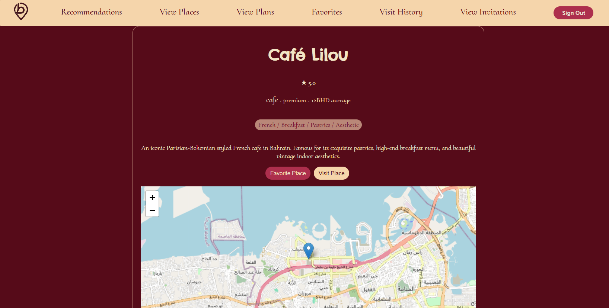

 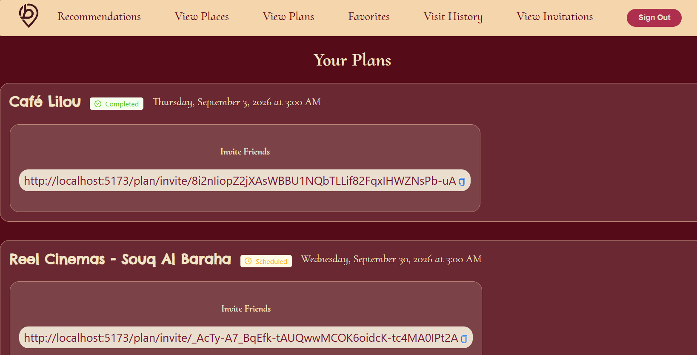

 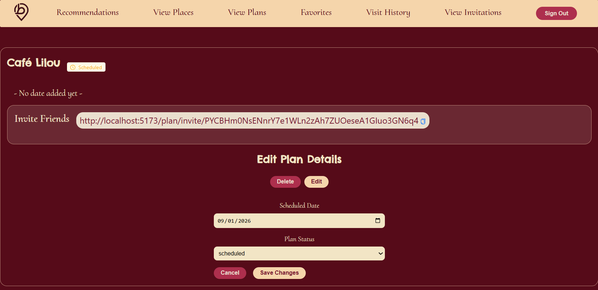

 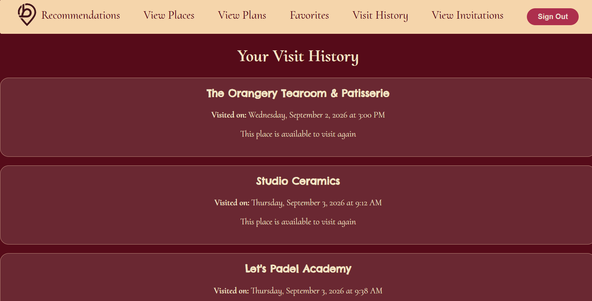

 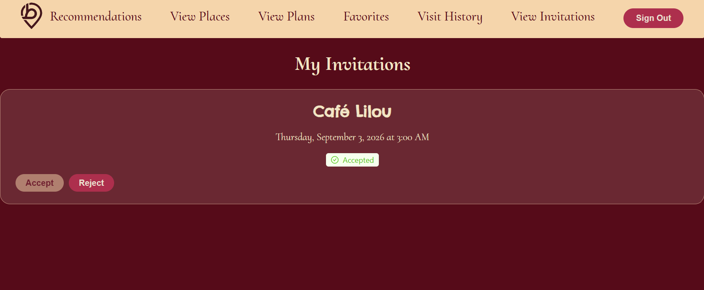

 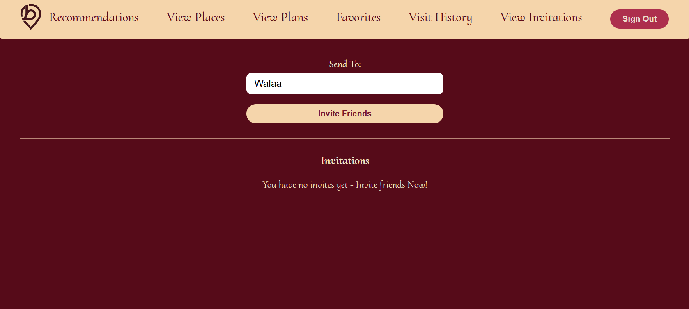

 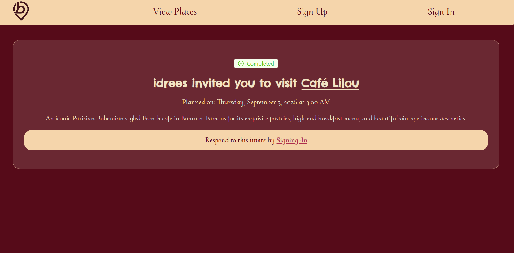

 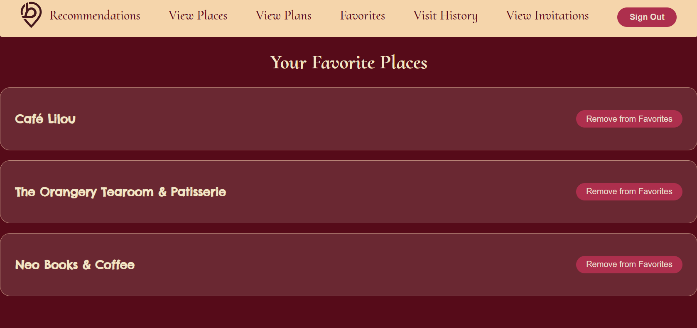

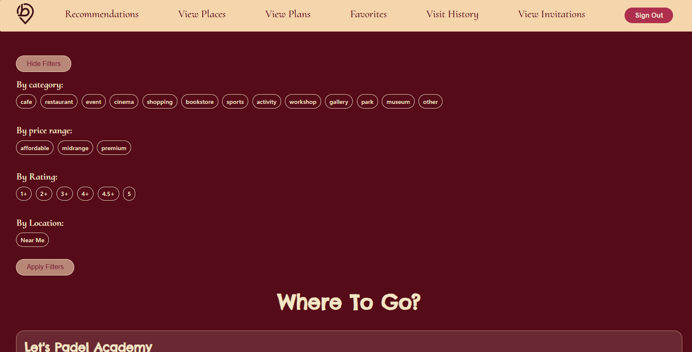

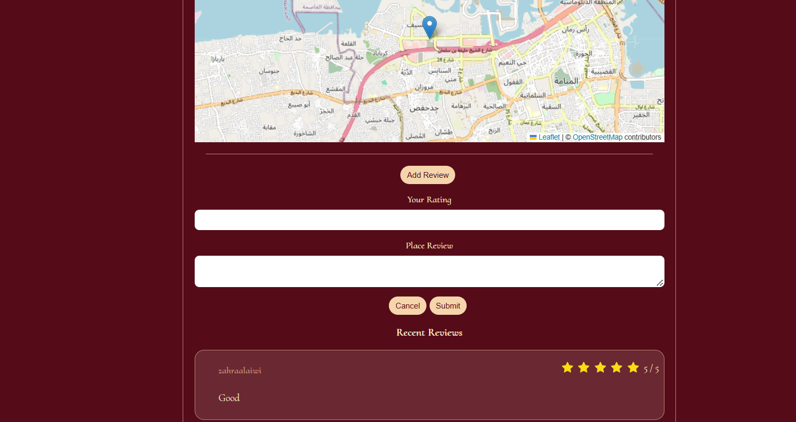

### Admin Pages
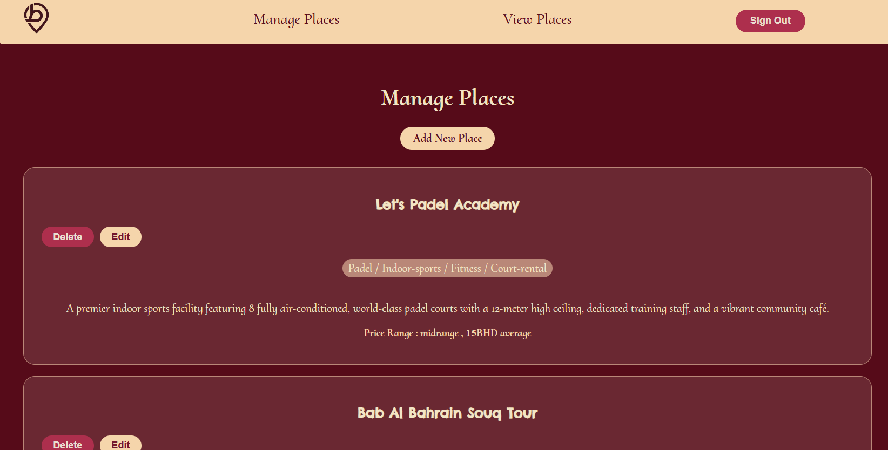

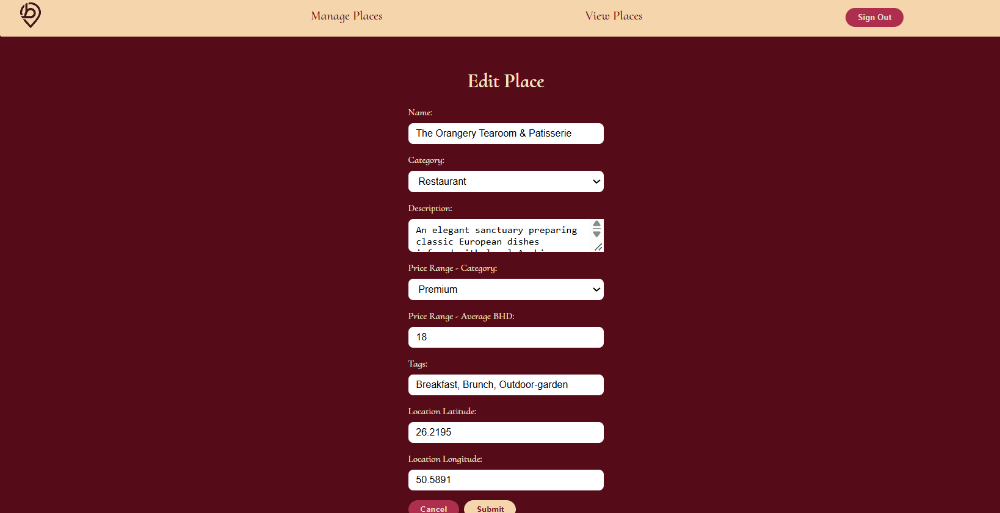


## Technologies Used

- React
- Vite
- React Router
- Axios
- Ant Design
- React-Leaflet / Leaflet
- CSS Modules


## Features

- User registration and login with JWT-based authentication
- Protected routes for authenticated-only pages, with role-based access for admin-only actions
- Browse all places with combined filtering by category, price range, and minimum rating
- "Near Me" search using the browser's geolocation API, combined with the same filters
- Interactive Leaflet map showing a place's exact location
- Personalized recommendation page based on visit history, category balance, cooldown, and rating
- Visit logging with cooldown-aware history
- Favorite / unfavorite places
- Leave and view reviews with star ratings
- Create and manage outing plans (status, scheduled date)
- Shareable, publicly viewable plan invite links (no login required to view)
- Account-based invite system with accept/reject flow
- Admin tools to create, edit, and delete places


## Project Structure

If you have different structure than this then add or remove from it

```text
public/
src/
├── assets/
├── components/
├── context/
├── images/
├── pages/
├── services/
├── styles/
├── App.jsx
└── main.jsx
```

## Getting Started

### Prerequisites

Install the following before running the project:

- node.js

The backend API has to be working. See the [Tal'a Backend repository](https://github.com/WA-2211/Tala-Backend) or use the deployed instance above.

## Installation

### 1. Clone the repository

```bash
git clone https://github.com/WA-2211/Tala-Frontend
cd Tala-Frontend
```

### 2. Install dependencies

```bash
npm i
```

### 3. Create the environment file

Create a `.env` file in the root directory:

```env
VITE_BACK_END_SERVER_URL=http://localhost:3000
```

### 4. Start the development server

```bash
npm run dev
```

Go to:

```text
http://localhost:5173
```


## Application Routes
| Route                       | Page                                 | Access        |
| ----------------------------- | -------------------------------------- | -------------- |
| `/`                          | Home page                            | Public         |
| `/sign-up`                   | Sign up                              | Public         |
| `/sign-in`                   | Sign in                              | Public         |
| `/place`                     | Browse all places                    | Public         |
| `/place/:placeId`            | Place details                        | Public         |
| `/plan/invite/:inviteLink`   | View a plan invite via public link   | Public         |
| `/recommended`               | Personalized recommendations         | Authenticated  |
| `/visit`                     | Visit history                        | Authenticated  |
| `/favorite`                  | Favorite places                      | Authenticated  |
| `/plan`                      | My plans                             | Authenticated  |
| `/plan/:planId`              | Plan details                         | Owner          |
| `/plan/:planId/invite`       | Create an invite for a plan          | Owner          |
| `/invite`                    | My invites                           | Authenticated  |
| `/admin/place`               | Manage places                        | Admin          |
| `/admin/place/create`        | Create a place                       | Admin          |
| `/admin/place/:placeId/edit` | Edit a place                         | Admin          |


## User Stories
**As a guest,**
- I want to browse places without creating an account, so that I can explore what Tal'a offers before signing up.
- I want to view a place's details, reviews, and location on a map, so that I can decide if it's worth visiting.
- I want to view a shared plan invite link, so that I can see the outing details before deciding to join.
- I want to sign up for an account, so that I can save visits, favorites, and get personalized recommendations.

**As a registered user,**
- I want to log in and out securely, so that my activity and data stay tied to my account.
- I want to filter places by category, price range, and minimum rating, so that I can find places that match what I'm looking for.
- I want to search for places near my current location, so that I can find somewhere close by.
- I want to see personalized recommendations, so that I'm nudged toward places I haven't been to recently instead of my usual spots.
- I want to log a visit to a place, so that it's reflected in my recommendations and excluded for a cooldown period.
- I want to save places to my favorites, so that I can quickly find them again later.
- I want to leave a review and rating for a place, so that I can share my experience and help other users.
- I want to create an outing plan for a place with a scheduled date, so that I can organize when I'm going.
- I want to generate a shareable invite link for my plan, so that I can invite friends without them needing an account to view it.
- I want to invite a specific user to my plan by username, so that they get notified and can join.
- I want to see and respond to invites sent to me, so that I can accept or reject plans I've been invited to.
- I want to update or delete my own plans and visits, so that I can keep my data accurate.

**As an admin,**
- I want to create new places, so that the catalog stays up to date.
- I want to edit or delete existing places, so that I can correct or remove outdated listings.
- I want place ratings to update automatically from reviews, so that I don't have to manage them manually.

## Future Enhancements
- Photo uploads for places
- Arabic language support with a language toggle, given Tal'a's Bahrain-based audience
- A native mobile app for on-the-go browsing and near-me search
- Email notifications when a plan invite is received or a plan's date is approaching
- Social features: following friends and seeing where they've been or plan to go
- Photo uploads on reviews
- Admin analytics dashboard (most-visited places, category trends, cooldown effectiveness)
- Real business accounts for venues to post live updates


## Team Members
 
| Name | GitHub | Responsibilities |
|---|---|---|
| Walaa Idrees | [GitHub profile](https://github.com/WA-2211) | Full-stack development |

## Credits
Built By Walaa Idrees as a part of Software Engineering Bootcamp final project